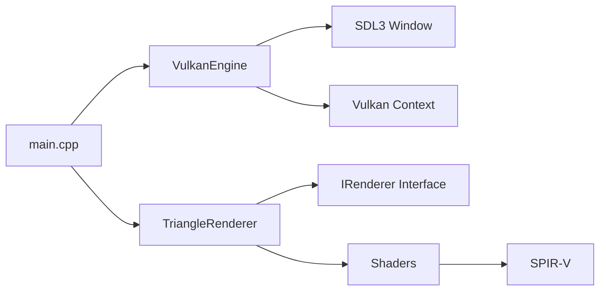

# Vulkan Visualizer Starter Template

[](https://github.com/vulkan-visualizer/vulkan-visualizer-starter-template/actions/workflows/windows-build.yml)
[](https://github.com/vulkan-visualizer/vulkan-visualizer-starter-template/actions/workflows/linux-build.yml)
[](https://github.com/vulkan-visualizer/vulkan-visualizer-starter-template/actions/workflows/macos-build.yml)
[](LICENSE)
[](https://cmake.org/)
[](https://isocpp.org/)
[](https://www.vulkan.org/)

A modern Vulkan application starter template built with **[Vulkan Visualizer](https://github.com/vulkan-visualizer/vulkan-visualizer)** - a powerful rendering framework that simplifies Vulkan development.


---

## 🚀 Quick Start

```bash
# Clone the repository
git clone https://github.com/vulkan-visualizer/vulkan-visualizer-starter-template.git
cd vulkan-visualizer-starter-template

# Configure and build (Release)
cmake -B build -S . -DCMAKE_BUILD_TYPE=Release
cmake --build build --config Release --parallel

# Run the application
cd build
./example_template  # Linux/macOS
# or
.\Release\example_template.exe  # Windows
```

The application will display a window with a simple colored triangle renderer.

---

## ✨ Features

- **🎨 Ready-to-run Example** - Colored triangle renderer with vertex shader-based geometry
- **🔧 Zero Dependencies** - Automated SDK setup via CMake bootstrap
- **📦 Shader Pipeline** - Automatic GLSL to SPIR-V compilation
- **🪟 Cross-Platform** - Windows, Linux, and macOS support with SDL3
- **🎯 ImGui Ready** - Built-in GUI framework integration
- **⚡ Modern Vulkan** - Dynamic rendering with Vulkan 1.3+ features
- **✅ CI/CD** - GitHub Actions workflows for all platforms

---

## 📋 Prerequisites

| Component | Version | Download |
|-----------|---------|----------|
| **CMake** | 3.26+ | [cmake.org](https://cmake.org/download/) |
| **C++ Compiler** | C++23 | MSVC 2022 / GCC 13+ / Clang 16+ |
| **Vulkan SDK** | 1.3+ | [vulkan.lunarg.com](https://vulkan.lunarg.com/) |
| **Git** | Any | [git-scm.com](https://git-scm.com/) |

> **Note**: The Vulkan SDK is required for shader compilation (`glslc` tool).

---

## 📁 Project Structure

```
vulkan-visualizer-starter-template/
├── 📄 main.cpp                  # Application entry point & TriangleRenderer
├── 📄 CMakeLists.txt            # Build configuration
├── 📁 cmake/
│   └── bootstrap.cmake          # Auto SDK setup script
├── 📁 shaders/
│   ├── triangle.vert            # Vertex shader (GLSL)
│   └── triangle.frag            # Fragment shader (GLSL)
├── 📁 .github/
│   └── workflows/               # CI/CD pipelines
│       ├── windows-build.yml
│       ├── linux-build.yml
│       └── macos-build.yml
└── 📄 README.md
```

---

## 🛠️ Build Instructions

### Windows (MSVC)

```cmd
cmake -B build -S . -DCMAKE_BUILD_TYPE=Release
cmake --build build --config Release
```

**Output**: `build/Release/example_template.exe`

### Linux

```bash
cmake -B build -S . -DCMAKE_BUILD_TYPE=Release
cmake --build build --parallel
```

**Output**: `build/example_template`

### macOS

```bash
cmake -B build -S . -DCMAKE_BUILD_TYPE=Release
cmake --build build --parallel
```

**Output**: `build/example_template`

> **Tip**: For debug builds, replace `Release` with `Debug` in the commands above.

---

## 🎓 How It Works

### Architecture Overview



### Key Components

1. **Bootstrap System** (`bootstrap.cmake`)
   - Automatically clones and builds Vulkan Visualizer SDK on first configure
   - Installs to `build/vulkan-visualizer-sdk/`
   - Caches build to avoid redundant compilation

2. **Shader Pipeline**
   - GLSL shaders in `shaders/` directory
   - Compiled to SPIR-V during build using `glslc`
   - Output: `build/shaders/*.spv`

3. **Renderer Implementation** (`TriangleRenderer`)
   - Inherits from `IRenderer` interface
   - Implements lifecycle methods:
     - `get_capabilities()` - Define rendering requirements
     - `initialize()` - Create pipelines and resources
     - `record_graphics()` - Record render commands
     - `destroy()` - Cleanup resources

4. **Engine Loop** (`VulkanEngine`)
   - Manages window lifecycle (SDL3)
   - Handles Vulkan device/queue initialization
   - Processes input events
   - Orchestrates frame rendering

---

## 🎨 Customization Guide

### Creating Your Own Renderer

1. **Define a new renderer class**:

```cpp
class MyCustomRenderer : public IRenderer
{
public:
    void query_required_device_caps(RendererCaps& caps) override {
        // Request device features
    }

    void get_capabilities(const EngineContext&, RendererCaps& caps) override {
        // Define attachments, formats, etc.
        caps.presentation_mode = PresentationMode::EngineBlit;
        caps.preferred_swapchain_format = VK_FORMAT_B8G8R8A8_UNORM;
        // ... add color/depth attachments
    }

    void initialize(const EngineContext& ctx, const RendererCaps&, const FrameContext&) override {
        // Create pipelines, descriptors, buffers
    }

    void record_graphics(VkCommandBuffer cmd, const EngineContext&, const FrameContext& frame) override {
        // Record rendering commands
    }

    void destroy(const EngineContext& ctx, const RendererCaps&) override {
        // Cleanup Vulkan resources
    }
};
```

2. **Update `main.cpp`**:

```cpp
int main() {
    VulkanEngine engine;
    engine.configure_window(1280, 720, "My Custom Renderer");
    engine.set_renderer(std::make_unique<MyCustomRenderer>());
    engine.init();
    engine.run();
    engine.cleanup();
    return 0;
}
```

3. **Add your shaders**:

```bash
# Add to shaders/ directory
shaders/
├── my_shader.vert
└── my_shader.frag
```

4. **Update `CMakeLists.txt`**:

```cmake
add_vv_example(
    NAME my_example
    SRC main.cpp
    SHADERS shaders/my_shader.vert shaders/my_shader.frag
)
```

---

## 🔄 CI/CD Pipelines

This template includes production-ready GitHub Actions workflows:

| Platform | Runner | Configurations | Artifacts |
|----------|--------|---------------|-----------|
| **Windows** | `windows-latest` | Release, Debug | `.exe`, `.dll`, shaders |
| **Linux** | `ubuntu-latest` | Release, Debug | binary, shaders |
| **macOS** | `macos-latest` | Release, Debug | binary, shaders |

### Features
- ✅ Automatic builds on push/PR to `main`, `master`, or `develop`
- ✅ Manual trigger support (`workflow_dispatch`)
- ✅ Parallel matrix builds (Release + Debug)
- ✅ Artifact uploads (7-day retention)
- ✅ Vulkan SDK caching for faster builds

---

## 📚 API Reference

### Core Classes

#### `VulkanEngine`
Main engine class managing application lifecycle.

```cpp
void configure_window(uint32_t width, uint32_t height, const char* title);
void set_renderer(std::unique_ptr<IRenderer> renderer);
void init();
void run();
void cleanup();
```

#### `IRenderer`
Interface for custom renderers.

```cpp
virtual void query_required_device_caps(RendererCaps&);
virtual void get_capabilities(const EngineContext&, RendererCaps&);
virtual void initialize(const EngineContext&, const RendererCaps&, const FrameContext&);
virtual void record_graphics(VkCommandBuffer, const EngineContext&, const FrameContext&);
virtual void destroy(const EngineContext&, const RendererCaps&);
```

For complete API documentation, see the [Vulkan Visualizer repository](https://github.com/vulkan-visualizer/vulkan-visualizer).

---

## 🐛 Troubleshooting

### Common Issues

**CMake cannot find Vulkan SDK**
```bash
# Set environment variable
export VULKAN_SDK=/path/to/vulkan/sdk  # Linux/macOS
set VULKAN_SDK=C:\VulkanSDK\1.3.xxx.x  # Windows
```

**Shader compilation fails**
- Ensure `glslc` is in your PATH (comes with Vulkan SDK)
- Check shader syntax errors in `shaders/*.vert` and `shaders/*.frag`

**Runtime validation errors**
- Enable validation layers by setting `VK_LAYER_PATH`
- Check `VK_CHECK` macro failures in console output

**Linker errors on Windows**
- Ensure you're using the correct MSVC runtime library (see `CMakeLists.txt`)
- Clean build directory: `rmdir /s /q build`

---

## 📄 License

This project is licensed under the MIT License - see the [LICENSE](LICENSE) file for details.

---

## 🤝 Contributing

Contributions are welcome! Please feel free to submit a Pull Request.

1. Fork the repository
2. Create your feature branch (`git checkout -b feature/AmazingFeature`)
3. Commit your changes (`git commit -m 'Add some AmazingFeature'`)
4. Push to the branch (`git push origin feature/AmazingFeature`)
5. Open a Pull Request

---

## 🔗 Resources

- **[Vulkan Visualizer Framework](https://github.com/vulkan-visualizer/vulkan-visualizer)** - Main framework repository
- **[Vulkan Guide](https://vkguide.dev/)** - Comprehensive Vulkan tutorial
- **[Vulkan Specification](https://www.vulkan.org/learn)** - Official Khronos documentation
- **[GLSL Reference](https://www.khronos.org/opengl/wiki/OpenGL_Shading_Language)** - Shader language specification
- **[SDL3 Documentation](https://wiki.libsdl.org/SDL3/)** - Windowing system docs

---

## ⭐ Show Your Support

If this template helped you get started with Vulkan development, please consider giving it a star ⭐!

---

<div align="center">

**[Report Bug](https://github.com/vulkan-visualizer/vulkan-visualizer-starter-template/issues)** • **[Request Feature](https://github.com/vulkan-visualizer/vulkan-visualizer-starter-template/issues)** • **[Discussions](https://github.com/vulkan-visualizer/vulkan-visualizer-starter-template/discussions)**

Made with ❤️ using Vulkan Visualizer

</div>
